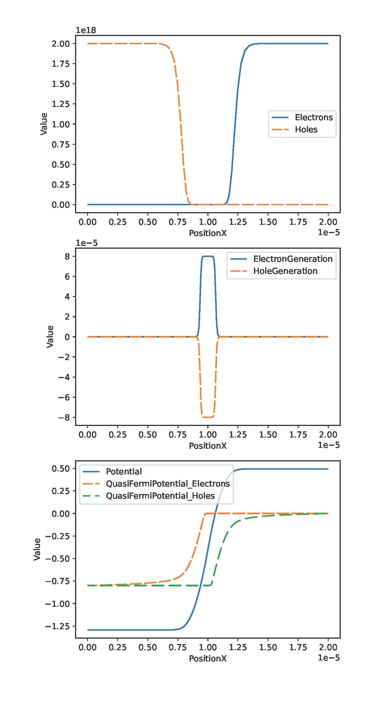

# QSDevsim

This project aims to simulate semiconductor and ferroelectric devices. It is based on the open-source semiconductor device simulator DEVSIM [https://www.devsim.org/] which takes Python as the interface language.
If you want to use this project, the best Python platform is Conda or MiniConda. It can run on Windows, MacOS, and Linux, but I just tested this work on Ubuntu Linux. 
The necessary python library includes mkl, numpy, matplotlib, pandas, scipy, sympy and so on. The mesh file for 2D simulation is generated by Gmsh. The exported data files could be visualized by [https://www.visitusers.org]

If you have any questions about this project, please discuss it in the forum of DevSim 
[https://forum.devsim.org/t/shared-project-for-ferroelectric-and-organic-devices/245].

At present, there are just four example devices:

The first one is the P-N junction diode, which can be used in the teaching of semiconductor courses.
It also can be modified to simulate your own devices according add proper physical models.

The second one is a ferroelectric capacitor with a step-like shape. This work is based on the Miller empirical equations [J. Appl. Phys. 1990, 68, 6463]. Users can apply this model from 1D to 3D devices.

The third one is a P-type ferroelectric thin film transistor with a bottom-gate and bottom-contact configuration. The ferroelectric model used in this work is the same as the second work. This work has been published in Physica Status Solidi (a) 2021, 218 (22).

If you use the ferroelectric model in your research, please cite the following paper:
Q. Chen, D. Lin, Q. Wang, J. Yang, J. E. Sanchez, G. Zhu, physica status solidi (a) 2021, 218 (22), https://doi.org/10.1002/pssa.202100408.

The fourth one is a work to analyze traps in organic semiconductors. It can be used in different types of organic devices, like field effect transistors, diodes, and so on.
This is a noncommercial free project because it has been granted with a Chinese patent [Granted No.：CN 113297818 B]. But it is free for research and personal purposes. The theoretical details can be found in the PDF file. This work has been published on this paper: Q. Chen, J. E. Sanchez, D. Lin, Y. Lei, G. Zhu, Organic Electronics 2022, 103, 106464, https://doi.org/10.1016/j.orgel.2022.106464. If you use this model in your research, please cite this paper.

Diode

Ferroelectric Capacitor

Ferroelectric BCBG TFT 

Organic Traps in TFT

(
